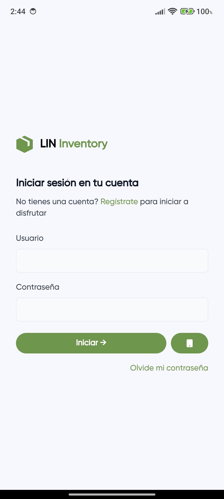
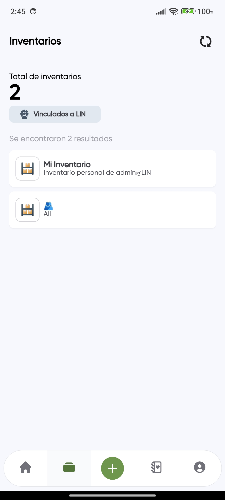
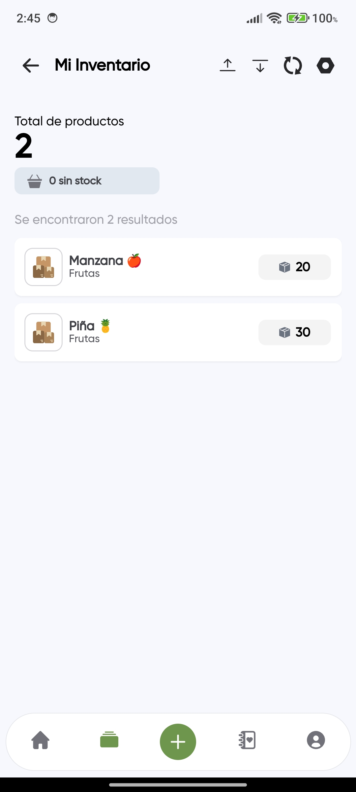
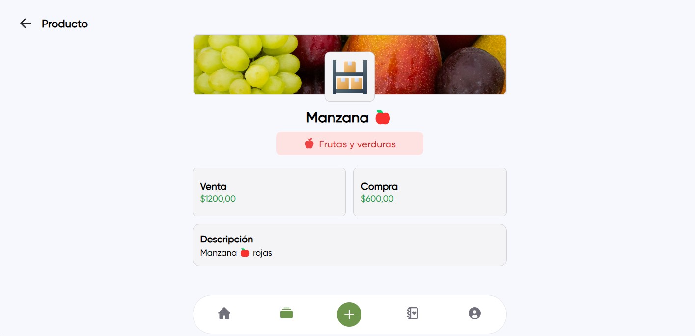

# LIN Inventory

Aplicación para la gestión de inventarios en tiempo real desde las plataformas Android y Windows

## Tecnologias

- .NET 8
- Blazor y Maui Hybrid App
- HTML, CSS y Tailwind

## Caracteristicas

- Actualizacion en tiempo real. (SignalR)
- Passkey para iniciar con huella digital. (Usando el proyecto LIN Vault) 
- Multiplataforma. (Android y Windows)

## Login

## Inventario

## Dependecias y otras librerias

- Necesita LIN.Server (Servidor)
- Necesita LIN.Developer (Servidor)
- Necesita LIN.Shared (Dependecia)
- Necesita LIN.Access (Dependecia)
- Necesita LIN.Access.Developer (Dependecia)

## Soporte

Para soporte, correo giraldojhong4@gmail.com

