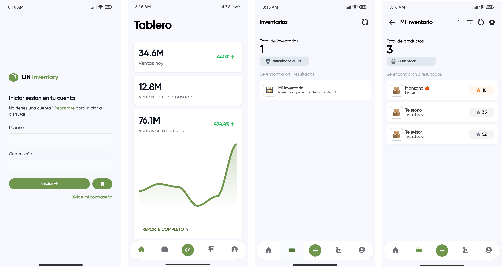
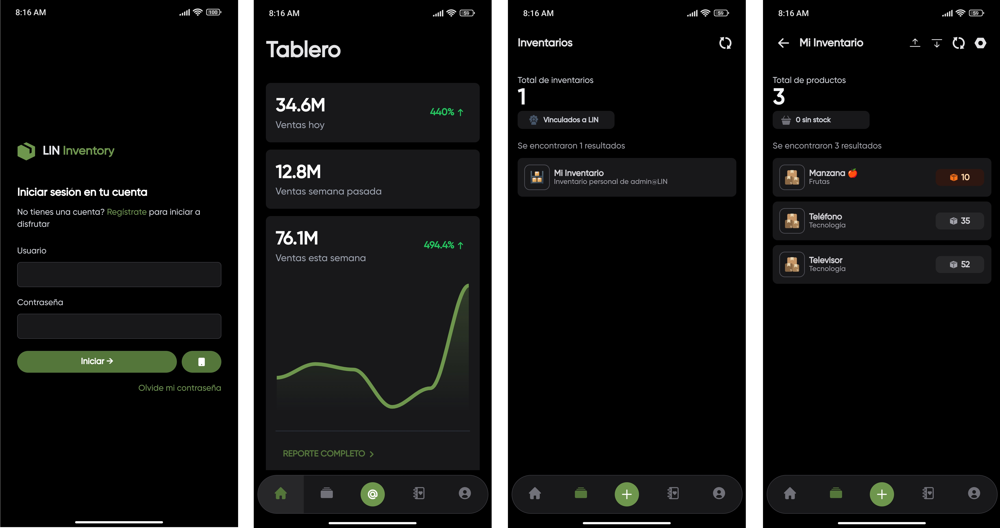
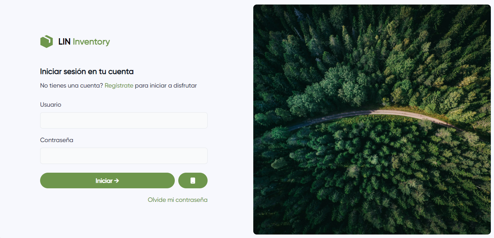
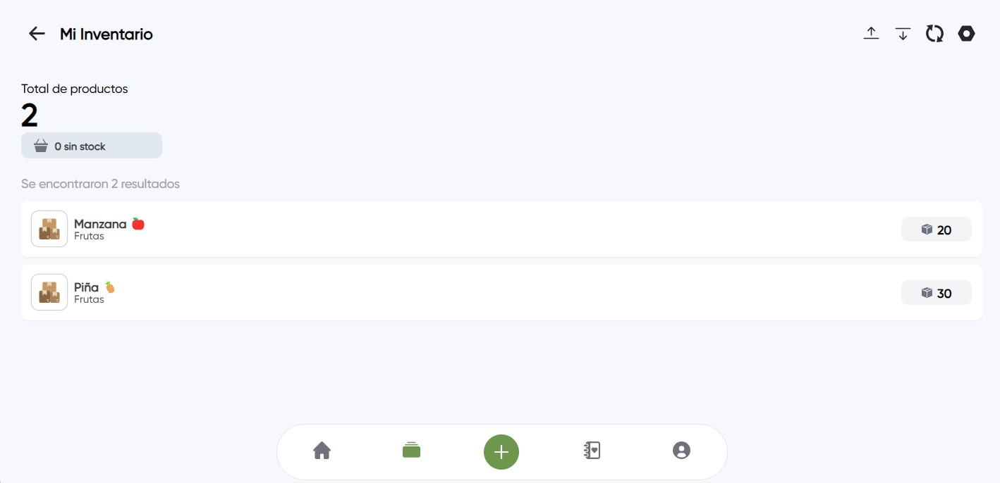

  

    
  

  
LIN Inventory es un proyecto de gestión de inventarios, disponible para todos con el objetivo de ser confiable, seguro y multiplataforma.

 

    
    
  

## Características

- Actualización de datos en tiempo real.
- Passkey para iniciar con huella digital. (Usando LIN Vault) 
- Multiplataforma. (Android y Windows)
- Multi-Inventario. (Compartir inventarios con otras personas)

## Tecnologías

- .NET 8.
- MAUI & Blazor Hybrid App.
- HTML, CSS y JavaScript.
- Tailwind CSS.

## Home

#### Modo claro

#### Modo oscuro

## Login

## Inventario

# Soporte

Para soporte, correo giraldojhong4@gmail.com

